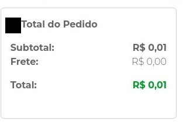

# Case: Business Logic – Web

**Tipo de falha:** Business Logic Flaw  
**Gravidade:** Alta  
**Categoria:** E-commerce

## Contexto
Durante a análise de fluxos de compra em uma aplicação web, identifiquei um cenário em que a lógica de negócios poderia ser contornada passivamente, sem exploração real ou impacto a outros usuários. A análise foi conduzida de forma ética, em ambiente controlado, sem realizar transações.

## Análise
Hipótese: A aplicação poderia aceitar valores incorretos enviados ao backend.  

A análise focou no fluxo de adição de produtos ao carrinho. Foi observado que o parâmetro de **quantidade** aceitava valores decimais em produtos indivisíveis, e o sistema calculava o preço final com base nesse valor, aceitando-o como legítimo em todas as etapas do checkout.

## Evidência (Redacted)


## Código exemplificando a falha

```python
preco = 150
quantidade = 0.01 #Valor decimal injetado

resultado = preco * quantidade
print(f"Valor final: {resultado}") #Valor abaixo do que o esperado
```

## Causa principal
Ausência de validação server-side para tipo e limites do parâmetro de quantidade.

## Impacto
A falha permite:
- Aquisição de produtos por valores incorretos  
- Potencial prejuízo financeiro  
- Possibilidade de exploração automatizada em larga escala

## Recomendações
- Validar rigorosamente tipos e limites de parâmetros no backend  
- Não aceitar valores decimais em produtos indivisíveis  
- Monitorar e registrar comportamentos anômalos nos processos de compra