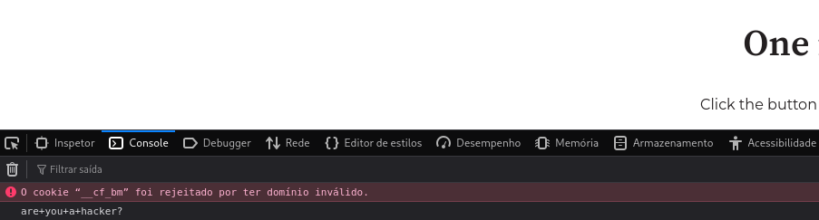

# Reflected XSS Non-Self — Aplicação Web

**Tipo de vulnerabilidade:** Reflected XSS (Cross-Site Scripting) — Non-Self   
**Severidade:** Média   
**Categoria:** A03:2021 – Injection / CWE-79

## Resumo Executivo

Durante a análise do fluxo de autenticação da aplicação, foi identificado um **Reflected Cross-Site Scripting (XSS)** causado pela reflexão de um parâmetro controlado pelo usuário dentro de uma string JavaScript.

A aplicação disponibilizava duas formas de autenticação: por meio de um link enviado por e-mail ou utilizando usuário e senha.

No fluxo de autenticação por e-mail, o processo ocorria da seguinte forma:

```text
Usuário informa o e-mail
        ↓
Recebe um link de autenticação
        ↓
Acessa a página de autenticação
        ↓
Clica no botão de login
        ↓
A aplicação valida o token
        ↓
Usuário é autenticado
```

A vulnerabilidade foi identificada na página intermediária exibida após o acesso ao link enviado por e-mail.

## Contexto da Falha

Ao acessar a página de autenticação, um parâmetro GET denominado `data` era utilizado para transportar o token de acesso do usuário.

A página utilizava esse parâmetro para construir dinamicamente a URL atribuída ao botão de login. O valor controlado pelo usuário era inserido diretamente em uma string JavaScript, sem a devida validação ou codificação.

Um trecho simplificado do código responsável por essa operação é apresentado abaixo:

```javascript
<script>
...
function updateLinkButton() {
    var button = document.getElementById('hs-button');

    if (button) {
        button.setAttribute(
            'href',
            'https://www.alvo.com/fluxo/login/auth?data=token&outro=...'
        );
    }
}
...
</script>
```

Nesse contexto, o valor fornecido por meio do parâmetro `data` era refletido dentro do código JavaScript da página.

Como o valor era inserido diretamente no contexto de uma string, caracteres especiais poderiam ser utilizados para **encerrar a string e inserir código JavaScript adicional**.

## Injeção de JavaScript

Para validar a possibilidade de execução de código, foi utilizado um payload simples com `console.log()`, evitando qualquer ação adicional sobre a aplicação.

O payload utilizado foi:

```javascript
');console.log('are you a hacker?')//
```

O payload foi construído para:

1. Fechar a string existente com `'`.
2. Encerrar a instrução JavaScript atual.
3. Executar `console.log()` como código adicional.
4. Utilizar `//` para comentar o restante da linha e evitar interferências na sintaxe original.

Após a inserção do payload no parâmetro, o código JavaScript resultante ficou, de forma simplificada, da seguinte maneira:

```javascript
<script>
...
function updateLinkButton() {
    var button = document.getElementById('hs-button');

    if (button) {
        button.setAttribute(
            'href',
            'https://www.alvo.com/fluxo/login/auth?data='
        );

        console.log('are you a hacker?')//
    }
}
...
</script>
```

Dessa forma, o conteúdo controlado pelo usuário deixou de ser tratado exclusivamente como dado e passou a ser interpretado como **código JavaScript**, resultando na execução do payload no navegador.

### Código injetado no parâmetro


### Execução do payload



## Impacto

Embora o parâmetro vulnerável faça parte de um fluxo específico de autenticação, a página intermediária podia ser acessada diretamente. Dessa forma, um atacante poderia criar uma URL contendo um payload malicioso e enviá-la para uma vítima.

Ao acessar a URL, o navegador da vítima carregaria a página normalmente e o código JavaScript injetado seria executado dentro do contexto da aplicação.

Como o código é executado no contexto da origem da aplicação, um atacante poderia, dependendo das proteções implementadas e dos privilégios disponíveis para o usuário, realizar ações como:

* Acessar ou manipular elementos e informações presentes na página;
* Ler dados disponíveis ao JavaScript no contexto da aplicação;
* Realizar requisições em nome da vítima para funcionalidades acessíveis ao seu usuário;
* Executar ações indevidas utilizando os privilégios da vítima;
* Manipular o conteúdo apresentado ao usuário, incluindo formulários e links;
* Capturar informações inseridas pelo usuário em páginas afetadas;
* Realizar ataques de phishing dentro do próprio contexto da aplicação;
* Em determinadas condições, obter informações relacionadas à sessão ou credenciais armazenadas de forma acessível ao JavaScript.

No caso de cookies de sessão, a possibilidade de leitura direta depende das configurações utilizadas pela aplicação. Cookies protegidos com `HttpOnly`, por exemplo, não podem ser acessados diretamente por JavaScript. Isso, entretanto, não impede necessariamente que um XSS realize requisições autenticadas em nome da vítima enquanto a sessão estiver ativa.

O impacto efetivo, portanto, depende das permissões do usuário afetado, dos dados disponíveis no contexto da aplicação e dos mecanismos de proteção implementados.

## Como Corrigir

A principal correção consiste em **impedir que dados controlados pelo usuário sejam inseridos diretamente em código JavaScript executável**.

Como o parâmetro `data` é utilizado para construir uma URL, o valor deve ser tratado como dado e devidamente codificado antes de ser inserido no atributo `href`.

Quando possível, recomenda-se evitar a construção de código JavaScript utilizando concatenação de strings com dados provenientes do usuário. A aplicação deve utilizar APIs apropriadas para manipulação de URLs e valores de parâmetros.

Por exemplo, em vez de inserir diretamente um valor não confiável em uma string JavaScript:

```javascript
button.setAttribute(
    'href',
    'https://www.alvo.com/fluxo/login/auth?data=' + data
);
```

deve-se utilizar uma abordagem que faça o devido tratamento e codificação do parâmetro:

```javascript
var url = new URL(
    'https://www.alvo.com/fluxo/login/auth'
);

url.searchParams.set('data', data);

button.setAttribute('href', url.toString());
```

Além disso, recomenda-se:

* Implementar **validação de entrada** no servidor, de acordo com o formato esperado para o parâmetro;
* Aplicar **context-aware output encoding** sempre que dados controlados pelo usuário forem inseridos em HTML, JavaScript, CSS ou outros contextos interpretáveis;
* Evitar inserir dados não confiáveis diretamente em blocos `<script>`;
* Implementar uma **Content Security Policy (CSP)** adequada como camada adicional de proteção;
* Utilizar cookies de sessão com as flags **`HttpOnly`**, **`Secure`** e **`SameSite`** adequadamente configuradas;
* Validar no servidor os parâmetros utilizados no fluxo de autenticação e rejeitar valores fora do formato esperado.

A correção deve ser realizada **no ponto em que o dado não confiável é inserido no contexto executável**, e não apenas por meio de filtros no cliente. A validação no servidor deve ser considerada a principal camada de controle, enquanto mecanismos como CSP e flags de cookies devem atuar como medidas complementares.


